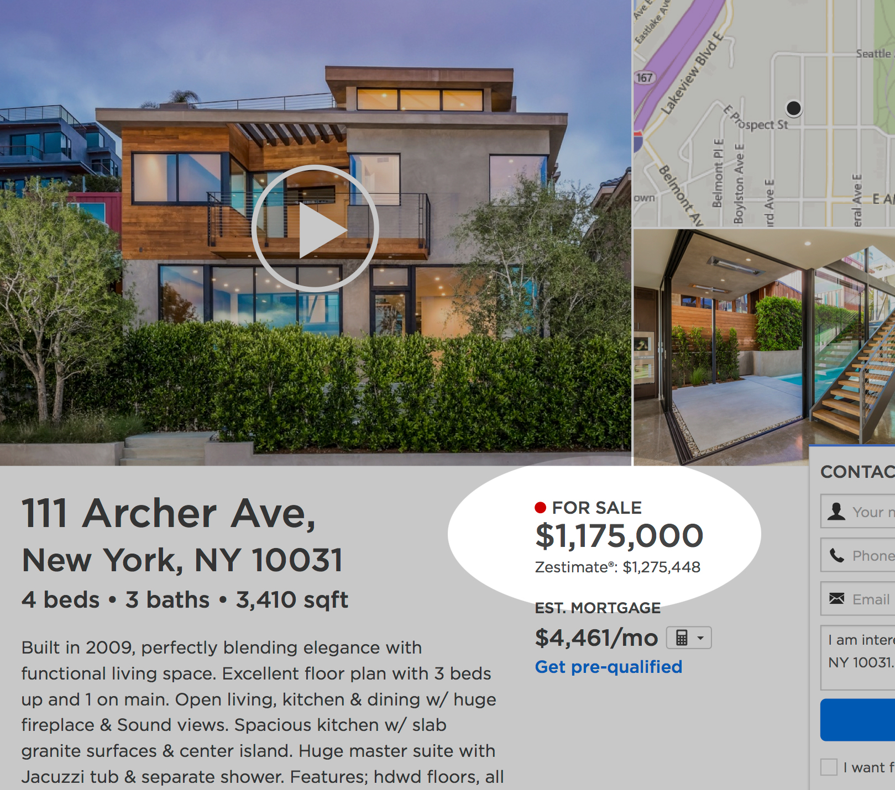

## Build your first Neural Network to predict house prices with Keras implementation
### Introduction
[Zillow Prize](https://www.kaggle.com/c/zillow-prize-1):Zillow’s Home Value Prediction (Zestimate) In this competition, Zillow is asking you to predict the log-error between their Zestimate and the actual sale price, given all the features of a home. 
 
### Resources you need:

The dataset I use today is adapted from Zillow’s Home Value Prediction Kaggle competition data. I’ve reduced the number of input features and changed the task into predicting whether the house price is above or below median value. Please visit the below link to download the modified dataset below and place it in the same directory as your notebook. The download icon should be on the top right.  [Download Dataset](https://drive.google.com/file/d/1GfvKA0qznNVknghV4botnNxyH-KvODOC/view)

### In this notebook, I’ve written Python code to:

- Explore and Process the Data
- Build and Train the Neural Network
- Visualize Loss and Accuracy
Add Regularization to the Neural Network
  * For more explanation, you can read this 
  [post](https://hackernoon.com/build-your-first-neural-network-to-predict-house-prices-with-keras-3fb0839680f4)